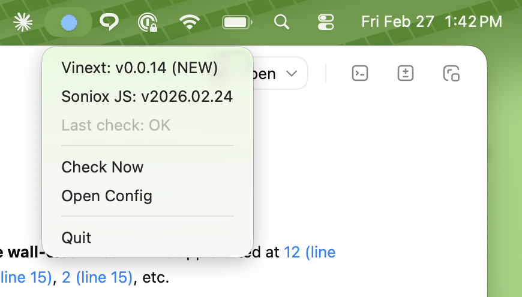

# GitHub Menubar Watcher

A lightweight macOS menubar app that monitors GitHub repositories for new tags and releases.




## Features

- Lives in your menubar — no dock icon, no windows
- Monitors any combination of GitHub tags and releases
- Configurable check interval (default: 60 minutes)
- Native macOS notifications for new versions
- Click any repo to copy the version string
- Green flash before each scheduled check
- Icon states: gray (idle), orange (new version), red (error)
- Runs at login via LaunchAgent
- Works with or without a GitHub token (token increases rate limit)

## Quick Start

```bash
git clone https://github.com/solracnyc/github-menubar-watcher.git
cd github-menubar-watcher
bash install.sh
```

The installer will:
1. Check for Python 3.10+
2. Create a virtual environment and install dependencies
3. Copy `config.example.json` to `config.json` (if not present)
4. Install and start a LaunchAgent (runs at login)

## Configuration

Edit `config.json` to add your repos:

```json
{
  "check_interval_minutes": 60,
  "repos": [
    {
      "owner": "torvalds",
      "repo": "linux",
      "watch": "tags",
      "label": "Linux Kernel"
    },
    {
      "owner": "nodejs",
      "repo": "node",
      "watch": "releases",
      "label": "Node.js"
    }
  ]
}
```

Each repo entry requires:

| Field | Description |
|-------|-------------|
| `owner` | GitHub user or org |
| `repo` | Repository name |
| `watch` | `"tags"` or `"releases"` |
| `label` | Display name in the menubar dropdown |

After editing, click **Check Now** in the menu or restart the app.

## GitHub Token (Optional)

Without a token, you get 60 API requests/hour. With a token: 5,000/hour.

Store your token in the macOS Keychain:

```bash
security add-generic-password -s github-menubar-watcher -a github-token -w "ghp_yourTokenHere"
```

Or set the `GITHUB_TOKEN` environment variable.

## Icon States

| Icon | Meaning |
|------|---------|
| Gray | Idle — all repos up to date |
| Orange | New version detected — click a repo to dismiss |
| Red | Error — check the menu for details |
| Green (flash) | Pre-check indicator — scheduled check in ~2 min |

## Uninstall

```bash
bash uninstall.sh
```

This stops the LaunchAgent and removes the plist. Project files are left in place.

## Requirements

- macOS (Apple Silicon or Intel)
- Python 3.10+

## License

[MIT](LICENSE)
